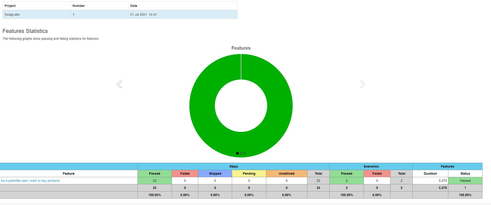
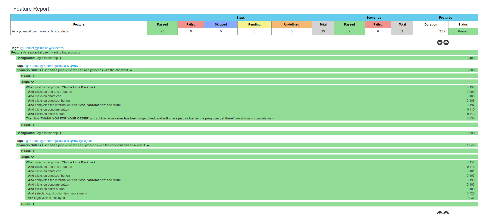

# Swag Labs Automation

## Installation
* You need to have JDK 1.8 and Maven installed. Follow this link to install both in Mac OS: https://www.journaldev.com/2348/install-maven-mac-os
* [Intellij community](https://www.jetbrains.com/idea/download/#section=windows)
* [Docker compose](https://docs.docker.com/compose/install/) if you want to run with grid (Exercise 2)

## Run
### all testcases with report:
mvn clean verify

### all testcases without report:
mvn clean test

### only product (Exercise 1):
mvn clean verify "-Dcucumber.filter=-t @Product"

### only smoke:
mvn clean test "-Dcucumber.filter=-t @Smoke"

### run in parallel without Grid
mvn clean test "-Dcucumber.filter=-t @Product" -Dtestng.runner=testngParallel.xml

## Debug:
mvn clean test -DforkCount=0

## Enable report:
To enable the report we only need to execute with the maven phase "verify" instead of "test": mvn clean verify

## Multi browsers
For default the framework runs with Chrome, to run with Firefox add to the mvn command line: -D browser=firefox
For example: mvn clean test -D browser=firefox

## BONUS Exercise: run with grid and parallel
* Run the following command in the root project: **docker-compose up**
* In a different terminal or in Run configuration from Intellij, run: **mvn clean verify -Pgrid,runner "-Dcucumber.filter=-t @Product" -Dtestng.runner=testngParallel.xml**
* The 3 scenarios from **product.feature** will be run in parallel

## Technologies used:
* Java jdk 1.8
* Maven
* Selenium
* TestNG
* Cucumber
* Log4j
* Bonigarcia (Allows to get the browser driver and set up the configuration)

## Reports
The report, once we run the test, are located in reports/cucumber-html-reports/overview-features.html

## Bug report (Exercise 2)
I created a file called "Bug report.docx" in the root of the project with the detail of the bug report requested.

## Project structure
* src/test/resources/features = features files with the scenarios and gherkin
* src/test/java/Hooks = hooks of cucumber for this project (before and after)
* src/main/resources = properties files: cucumber options, log4 and project configs (config.properties)
* src/main/java/steps = steps that matches with gherkin from features files
* src/main/java/views = interactions with the views of the application
* src/main/java/core
    * DriverService: manage the driver instance
    * PropertyManager: loads the properties (located in config.properties) and use them in the lifecycle
* src/main/java/core/browser
  * Chrome and Firefox: browser internal configuration
  * Browser: interface for browsers
  * BrowserType: enum to get the browser requested
  * BrowserTypeInterface: interface for BrowserType